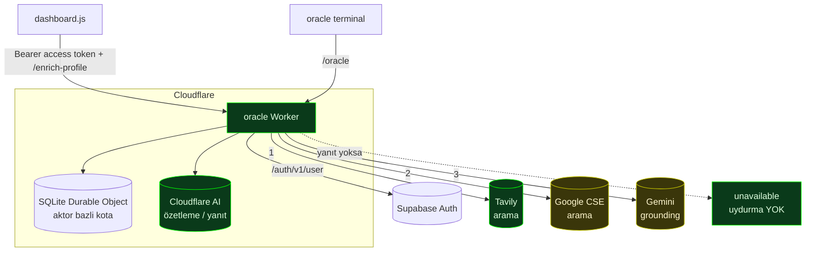
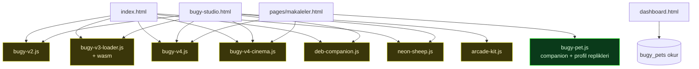
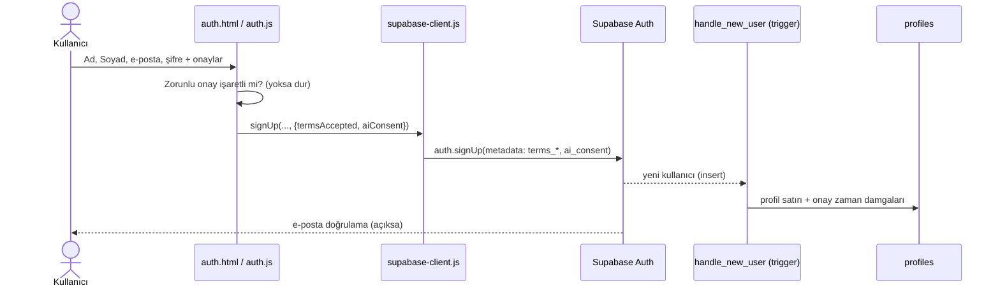
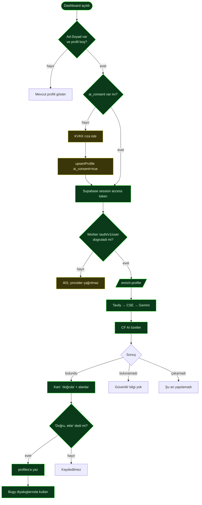

# Convivium — Mimari ve Akış Haritası

Bu klasör, sitenin **yaşayan** mimari/akış dokümantasyonudur. Diyagramlar
[Mermaid](https://mermaid.js.org/) ile yazılmıştır; GitHub bunları otomatik
çizer. Kod değiştikçe burayı da güncelleyin.

Durum renkleri: 🟩 tamamlandı · 🟨 yarım/iyileştirilebilir · ⬜ planlanan.

Nokta-zaman teknik incelemesi ve öncelikli geliştirme kuyruğu:
[17 Temmuz 2026 Site Teknik Değerlendirmesi](../site-teknik-degerlendirme-2026-07-17.md).
Ana terminal ayrıştırmasının yaşayan uygulama kaydı:
[Home Protocol Modülerleştirme Handoff](../home-protocol-modularization-handoff.md).
P0/P1 güvenlik ve dağıtım kapanış kaydı:
[Üretim Sertleştirme Handoff](../production-hardening-handoff.md).
Gerçek HTTP güvenlik header'ları ve hosting sınırı:
[ADR-001 — HTTP Güvenlik Header'ları ve Hosting](adr-001-http-security-headers.md).

İçindekiler:
1. [Sayfa haritası (gruplu)](#1-makro--sayfa-haritası)
2. [Veri katmanı (Supabase)](#2-veri-katmanı--supabase-tabloları)
3. [Worker ve dış servisler](#3-worker-ve-dış-servisler)
4. [Bugy ekosistemi](#4-bugy-ekosistemi-sürümler)
5. [Sayfa → Modül → Veri envanteri](#5-sayfa--modül--veri-envanteri)
6. [Akış: Üyelik + Onay](#6-akış-üyelik--onay)
7. [Akış: Profil zenginleştirme](#7-akış-profil-zenginleştirme)
8. [Durum tablosu](#8-durum-tablosu)
9. [Otomatik testler](#9-otomatik-akış-kontrolü)

---

## 1. Makro — Sayfa Haritası

```mermaid
flowchart TD
  user([Ziyaretçi]) --> index[index.html\nHub / Ana sayfa]

  subgraph HESAP[Hesap]
    auth[auth.html\nÜyelik + Onaylar]
    dash[dashboard.html\nProfil · Bugy · Skorlar]
    admin[admin/index.html\nİçerik yönetimi]
  end

  subgraph ICERIK[İçerik]
    makale[pages/makaleler.html]
    ozgecmis[pages/ozgecmisim.html]
    legal[legal/*\nKVKK + Koşullar]
  end

  subgraph ARAC[Araçlar — auth-gate'li]
    barista[barista]
    bartender[bartender]
    realist[the-realists-bar]
    paradox[paradox-terminal]
  end

  subgraph BUGY[Bugy]
    studio[bugy-studio.html\nYaratık stüdyosu]
  end

  subgraph DART[Dart]
    dartboard[dart-skorbord.html\nATC · Cricket · Online]
  end

  subgraph OYUN[Oyunlar]
    ashr[ash-runner*]
    neon[neon-river*]
    uni[universe-2*]
    cyber[cyberpunk-logic*]
    tbody[three-body-signal\nserbest]
  end

  subgraph OZEL[Özel]
    oracle[oracle/index.html\nOracle terminal]
    offline[offline.html]
    nf[404.html]
    sw[service-worker.js\nPWA / cache]
  end

  index --> auth & oracle & makale & ozgecmis
  index --> barista & bartender & realist & paradox & studio & dartboard
  index --> ashr & neon & uni & cyber & tbody
  auth --> legal
  auth --> dash
  auth --> admin

  classDef done fill:#0a3a1a,stroke:#0f0,color:#dfffe0
  classDef partial fill:#3a360a,stroke:#cc0,color:#fff7cf
  classDef planned fill:#222,stroke:#777,color:#ccc
  class index,auth,dash,legal,oracle,makale done
  class admin,barista,bartender,realist,paradox,studio,dartboard,ashr,neon,uni,cyber,tbody,ozgecmis,offline,sw partial
```



> `*` = `auth-gate.js` ile korunan sayfa (giriş gerektirir).

---

## 2. Veri Katmanı — Supabase Tabloları

```mermaid
flowchart LR
  subgraph APP[Sayfalar / Modüller]
    auth2[auth.js]
    dash2[dashboard.js]
    admin2[admin.js / articles.js]
    art2[articles.js]
    dart2[dart-*.js]
    bugy2[bugy-pet.js]
    oracle2[oracle terminal]
    games2[oyunlar / arcade-kit]
  end

  subgraph DB[(Supabase)]
    profiles[(profiles)]
    articles[(articles)]
    scores[(game_scores)]
    sessions[(user_app_sessions)]
    recos[(app_recommendations)]
    dmatch[(dart_matches)]
    dthrow[(dart_throws)]
    bugypets[(bugy_pets)]
    oraclep[(oracle_profiles)]
    daily[(daily_signal)]
    wall[(wall_marks)]
    world[(world_state)]
  end

  auth2 --> profiles
  dash2 --> profiles & scores & sessions & recos & dmatch & dthrow & bugypets
  admin2 --> articles
  art2 --> articles
  dart2 --> dmatch & dthrow
  bugy2 --> bugypets
  oracle2 --> oraclep
  games2 --> scores & daily & wall & world

  classDef tracked fill:#0a3a1a,stroke:#0f0,color:#dfffe0
  class profiles,articles,scores,sessions,recos,dmatch,dthrow,bugypets,oraclep,daily,wall,world tracked
```

> 🟩 = `docs/database/supabase-schema.sql` içinde tanımlı. Tüm tablolar artık
> şema dosyasında kayıtlı (ARG/oyun tabloları 2026-06-26'da canlıdan birebir
> çıkarılıp eklendi).

---

## 3. Worker ve Dış Servisler



Sağlayıcı sırası: **Tavily → Google CSE → Gemini**. İlk başarılı olan kazanır;
hiçbiri çalışmazsa uydurma üretilmez. Profil provider'ları yalnız Supabase
Bearer token doğrulandıktan sonra çalışır. Oracle, auth denemesi, enrich ve
beacon ayrı Durable Object kota bucket'ları kullanır. `/health` no-store Worker
version metadata döndürür; beacon AI/webhook çağırmaz.

---

## 4. Bugy Ekosistemi (sürümler)

Birden çok Bugy uygulaması var; hangisi nerede kullanılıyor:



> Not: çok sayıda Bugy sürümü = olası konsolidasyon alanı. Hangisi "kanonik"?
> (izlenecek mimari borç.)

---

## 5. Sayfa → Modül → Veri Envanteri

| Sayfa | Ana modül(ler) | Veri | Giriş | Durum |
|-------|----------------|------|:----:|:----:|
| index.html | home-protocol + route/guide/VFS (navigation + kalıcı `/home`) modülleri, bugy-v2/v3/v4, arcade-kit | — / world_state + localStorage | — | 🟨 |
| account/auth.html | auth.js | profiles (trigger) | — | 🟩 |
| account/dashboard.html | dashboard.js | profiles, game_scores, dart_*, sessions, recos, bugy_pets | ✅ | 🟩 |
| admin/index.html | admin.js, articles.js | articles | ✅ admin | 🟨 |
| oracle/index.html | auth-gate, (worker) | oracle_profiles | ✅ | 🟩 |
| pages/makaleler.html | articles.js, bugy-pet | articles, bugy_pets | — | 🟩 |
| pages/ozgecmisim.html | sfx | — | — | 🟩 |
| legal/*.html | — | — | — | 🟨 (taslak) |
| tools/barista, bartender, the-realists-bar | auth-gate | sessions / recos | ✅ | 🟨 |
| tools/paradox-terminal.html | auth-gate | — | ✅ | 🟨 |
| tools/bugy-studio.html | bugy-studio + sürümler | — | — | 🟨 |
| tools/dart-skorbord.html | dart-atc/cricket/online/skorbord | dart_matches, dart_throws | ✅ | 🟨 |
| games/ash-runner, neon-river, universe-2, cyberpunk-logic | auth-gate, phaser/arcade | game_scores | ✅ | 🟨 |
| games/three-body-signal.html | sfx | daily_signal? | — | 🟨 |
| offline.html / 404.html | — | — | — | 🟩 |

Paylaşılan altyapı (her yerde): `supabase-client.js` + `supabase-config.js`,
`auth-gate.js` (korumalı sayfalar), `origin-beacon.js`, `theme.js`, `sfx.js`,
`utils.js`, `service-worker.js`.

---

## 6. Akış: Üyelik + Onay



---

## 7. Akış: Profil Zenginleştirme



---

## 8. Durum Tablosu

| Alan | Durum | Not |
|------|-------|-----|
| Üyelik + Ad/Soyad + onaylar | 🟩 | Canlı |
| KVKK / Kullanım Koşulları | 🟨 | Taslak; hukukçu incelemesi önerilir |
| Profil zenginleştirme (Tavily) | 🟩 | Canlı, test edildi |
| Google CSE sağlayıcı | 🟨 | Kod hazır; anahtar girilmedi |
| Gemini sağlayıcı | 🟨 | Yedek; ücretsiz kota sınırlı |
| Şema dosyası eksik tablolar | 🟩 | bugy_pets, oracle_profiles, daily_signal, wall_marks, world_state canlıdan birebir eklendi |
| Bugy sürüm konsolidasyonu | 🟨 | 6+ sürüm; kanonik olan netleşmeli |
| Eski üyeler için onay ekranı | ⬜ | Henüz yok |
| Otomatik akış testleri | 🟩 | `tests/` + `flow-check.yml` |

---

## 9. Otomatik Akış Kontrolü

Kurulu (bkz. [tests/README.md](../../tests/README.md)):

- `tests/smoke/smoke.mjs` — sayfalar 200, worker `/oracle` + `/enrich-profile`,
  Supabase erişimi. `npm run test:smoke`.
- `tests/e2e/` — Playwright (sayfa yüklemeleri, üyelik onay akışı, hukuki
  bağlantılar; tam kayıt `RUN_SIGNUP=1` ile opsiyonel).
- `.github/workflows/flow-check.yml` — `workflow_dispatch` ile **elle tetikle**.

> Mimariyi güncel tutmak için: yeni sayfa/akış eklediğinde ilgili Mermaid
> bloğuna düğüm + durum tablosuna satır ekle.
