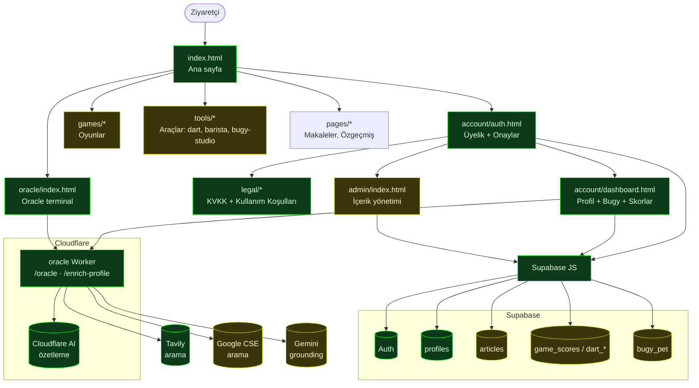
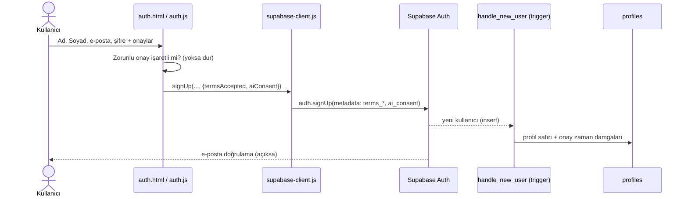
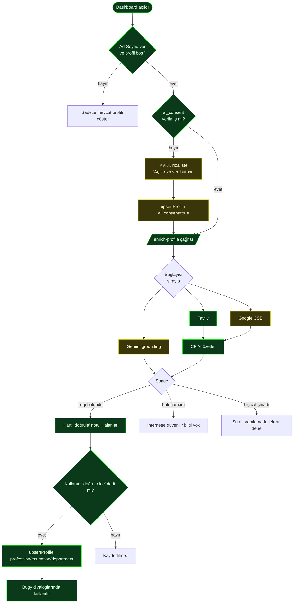

# Convivium — Mimari ve Akış Haritası

Bu klasör, sitenin **yaşayan** mimari/akış dokümantasyonudur. Diyagramlar
[Mermaid](https://mermaid.js.org/) ile yazılmıştır; GitHub bunları otomatik
çizer. Kod değiştikçe burayı da güncelleyin — amaç, hem makro (sitenin tümü)
hem mikro (tek akış) seviyede neyin nasıl bağlandığını ve **yarım kalan
alanları** tek bakışta görmektir.

Durum renkleri: 🟩 tamamlandı · 🟨 yarım/iyileştirilebilir · ⬜ planlanan.

---

## 1. Makro — Site Haritası ve Dış Servisler

> Not: durum renkleri örnek olarak işaretlendi — gerçek duruma göre güncelle.

---

## 2. Mikro — Üyelik + Onay Akışı

---

## 3. Mikro — Profil Zenginleştirme (AI Araştırma) Akışı

---

## 4. Durum Tablosu (yarım kalan / izlenecek alanlar)

| Alan | Durum | Not |
|------|-------|-----|
| Üyelik + Ad/Soyad + onaylar | 🟩 | Canlı |
| KVKK / Kullanım Koşulları metinleri | 🟨 | Taslak; hukukçu incelemesi önerilir |
| Profil zenginleştirme (Tavily) | 🟩 | Canlı, test edildi |
| Google CSE sağlayıcısı | 🟨 | Kod hazır; anahtar girilmedi |
| Gemini sağlayıcı | 🟨 | Yedek; ücretsiz kota sınırlı |
| Eski üyeler için onay ekranı | ⬜ | Henüz yok |
| Otomatik akış testleri (smoke/E2E) | 🟩 | `tests/` + `.github/workflows/flow-check.yml` |

---

## 5. Otomatik Akış Kontrolü

Kurulu (bkz. [tests/README.md](../../tests/README.md)):

- `tests/smoke/smoke.mjs` — dış uçları yoklar (worker `/enrich-profile` ve
  `/oracle`, sayfa 200'leri, Supabase erişimi). `npm run test:smoke`.
- `tests/e2e/` — Playwright ile gerçek tarayıcı akışı (sayfa yüklemeleri, üyelik
  onay akışı, hukuki bağlantılar; tam kayıt akışı `RUN_SIGNUP=1` ile opsiyonel).
- `.github/workflows/flow-check.yml` — `workflow_dispatch` ile **elle tetikle**;
  E2E raporu artifact olarak yüklenir. (İleride `schedule`/cron eklenebilir.)

Bu diyagramları güncel tutmak için: bir akış/sayfa eklediğinde ilgili Mermaid
bloğuna düğümü ekle ve durum tablosunu güncelle.
