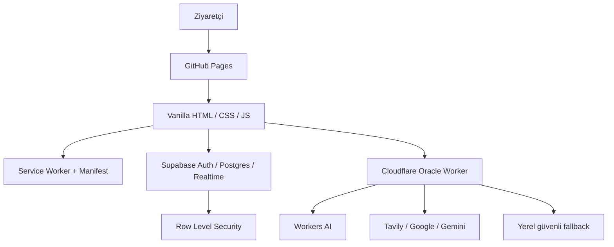

# Convivium Site Teknik Değerlendirmesi

Tarih: 17 Temmuz 2026  
İncelenen commit: `32aad94871608fdf68023d1f0271d0c32cc1cfc1` (`32aad94`)  
Kapsam: statik site, ortak frontend altyapısı, PWA, Supabase veri/yetki
katmanı, Cloudflare Oracle Worker, otomasyonlar, güvenlik, performans,
erişilebilirlik ve bakım maliyeti.

Bu belge belirli bir commit üzerindeki nokta-zaman değerlendirmesidir. Yaşayan
mimari için [architecture/README.md](architecture/README.md), uygulanan veri
şeması için [database/README.md](database/README.md) izlenmelidir.

## 0. Uygulama İlerlemesi

Aktif plan, kabul kapıları, rollback ve yarıda kalma kaydı:
[Home Protocol Modülerleştirme Handoff](home-protocol-modularization-handoff.md).

| Hat | Güncel durum | Sonuç |
|---|---|---|
| Terminal monolit Faz 1A | Tamamlandı; main'de | 23 route komutu ve 99 alias registry'ye taşındı; 132 komut korundu |
| Terminal monolit Faz 1B | Tamamlandı; canlı | 14 rehber komutu ve 75 alias ikinci registry'ye taşındı; 132 komut korundu; SW v198 |
| Terminal monolit Faz 2A | Tamamlandı; canlı | CWD + `resolve/ls/cd/cat` VFS factory'sine taşındı; Presence/Chat aynı oda kaynağında; SW v199 |
| Terminal monolit Faz 2B | Tamamlandı; canlı | Kalıcı `/home` storage ve dosya işlemleri VFS'ye taşındı; shell davranışı/limitler korundu; SW v200 |
| Terminal monolit Faz 2C | Tamamlandı; canlı | Sekiz odalık immutable world registry + görünüm/inceleme modeli ayrıldı; SW v201 |
| Terminal monolit Faz 2D | Tamamlandı; canlı | `take/unlock/use` kararları callback tabanlı world-actions factory'sine ayrıldı; yan etki sahipliği protocol'de; SW v202 |
| Terminal monolit Faz 3A | Tamamlandı; canlı | Shard award/spend/merge kararları economy factory'sine ayrıldı; legacy Supabase fallback test altında; SW v203 |
| Terminal monolit Faz 3B | Tamamlandı; canlı; hat parkta | Shop katalog/sahiplik/satın alma kararları ayrı factory'de; kozmetik storage/DOM etkileri protocol'de; SW v204 |
| Yeni ürün: Sinyal Arkeolojisi | Kod/test tamam; yayın bekliyor | Üç immutable kurmaca artifact, deterministik günlük buluntu, opsiyonel `/ruins` world/VFS extension; SW v205 yerel |
| P0 tekrarlanabilir kurulum | Tamamlandı | `npm ci` tekrarlanabilir; audit 0; CI `npm ci` + `npm run check` kullanıyor |
| P0 Worker kötüye kullanım sınırı | Tamamlandı; canlı | DO sayaç, Supabase auth, bounded JSON, yerel-only beacon, `/health`; kimliksiz enrich 401 |
| P0 Worker deploy kapısı | Tamamlandı; canlı | CI health/version tag'i `dc951919…` ile eşleşti |
| P1 Service Worker yaşam döngüsü | Tamamlandı; canlı | waitUntil/cache.put + kritik/best-effort precache; event testleri 5/5; canlı v196 |
| P1 CSP/CDN/header | Tamamlandı; canlı | 27/27 CSP; 22/22 harici script tam sürüm; Supabase 2.110.7; SW v197; ADR-001 |

Bu tablo inceleme anındaki bulguyu değiştirmez; yapılan işlerin güncel sonucunu
gösterir. Ayrıntılı doğrulama komutları yaşayan handoff'ta tutulur.

## 1. Yönetici Özeti

Convivium klasik bir portfolyo değil; oyun, terminal, kişisel arşiv ve deneysel
ürünleri aynı kurgu evreninde buluşturan bir web laboratuvarıdır. Yaratıcı
kimliği çok güçlüdür. Teknik açıdan site çalışır durumda ve tek kişilik bir
proje için dikkate değer ölçüde dokümante edilmiştir.

Ana problem işlevsizlik değil, büyüme hızıdır. Yaratıcı üretim hızı mimari
sadeleştirme hızını geçmiş; ana terminal, büyük tek-dosya oyunlar, PWA cache'i,
CI ve Worker güvenlik sınırları bakım maliyeti üretmeye başlamıştır.

Öznel değerlendirme:

| Alan | Puan |
|---|---:|
| Görsel kimlik ve özgünlük | 9/10 |
| Ürün/deneyim çeşitliliği | 9/10 |
| Teknik mimari | 7/10 |
| Güvenlik yaklaşımı | 7/10 |
| Test ve dağıtım disiplini | 6/10 |
| Uzun vadeli bakım kolaylığı | 5.5/10 |
| Genel | **7.5/10** |

## 2. Sayısal Envanter

Aşağıdaki değerler git tarafından izlenen dosyalar üzerinden çıkarılmıştır.

| Ölçüm | Değer |
|---|---:|
| İzlenen dosya | 187 |
| Toplam içerik büyüklüğü | yaklaşık 5,87 MB |
| Metin / ikili dosya | 153 / 34 |
| Toplam metin satırı | 64.078 |
| HTML sayfası | 27 |
| JavaScript/MJS | 51 dosya, 26.199 satır |
| CSS | 15 dosya, 11.500 satır |
| SQL | 14 dosya, 1.391 satır |
| Görsel | 34 PNG + 7 SVG |
| Oyun | 8 |
| Araç/ritüel uygulaması | 7 |
| Terminal rota tanımı | 28 |
| Terminal komutu | 132 |
| Supabase tablo tanımı | 14 benzersiz tablo |
| Ana şemadaki RLS politikası | 41 |
| Service Worker precache | 105 öğe, yaklaşık 3,74 MB |
| Sitemap URL sayısı | 23 |
| RSS öğesi | 21 |
| Commit | 497 |
| Geliştirme dönemi | 13 Şubat 2025 – 17 Temmuz 2026 |

### Sayfa ağırlıkları

- Ana sayfa yaklaşık 920 KB yerel statik kaynak bağlıyor: 27 JavaScript ve
  10 CSS dosyası. Supabase CDN ve Google Fonts bunun dışındadır.
- `ash-runner.html` ve `ash-runner-2.html`, yerel Phaser paketi nedeniyle
  yaklaşık 1,3 MB yerel kaynak kullanıyor.
- Ana Service Worker ilk kurulumda 105 girdiden oluşan yaklaşık 3,74 MB'lık
  precache listesi hazırlıyor.

## 3. Mimari Kanaat

Bu proje için framework kullanmamak halen doğru karardır. Site statik, deneysel
ve sayfa bazlıdır; tam bir React/Next benzeri yeniden yazım mevcut durumda
faydadan çok maliyet getirir. Buna karşılık native ES modules, küçük domain
modülleri ve sayfa bazlı geç yükleme artık gereklidir.

### Güçlü yönler

- Public AI istekleri tarayıcıdan doğrudan model sağlayıcılarına çıkmıyor;
  Worker güvenlik sınırı olarak kullanılıyor.
- Supabase anon anahtarı sır olarak değerlendirilmiyor; asıl yetki RLS
  politikalarında uygulanıyor.
- Auth oturumu `sessionStorage` içinde tutuluyor ve `returnTo` açık yönlendirme
  riskine karşı kontrol ediliyor.
- Makale içeriğinde tag, attribute ve URL allowlist'li sanitizasyon uygulanıyor.
- Profil araştırması açık rıza ve kullanıcının son onayına bağlanmış; yurt dışı
  aktarım KVKK metninde açıklanıyor.
- Güvenlik yüzeyi, veri katmanı ve yaşayan mimari ayrı belgelerde tutuluyor.
- PWA güncellemesi kullanıcı onaylı `SKIP_WAITING` akışıyla ele alınıyor.
- Kodun büyük bölümü üçüncü taraf framework bağımlılığı olmadan çalışıyor.

## 4. Öncelikli Teknik Bulgular

### P0 — Worker kötüye kullanım sınırı

Kanıt:

- [`workers/oracle/src/index.js`](../workers/oracle/src/index.js) içindeki rate
  limit, isolate belleğindeki `RATE_LIMITS` adlı `Map` ile tutuluyor.
- `/beacon` rotası genel CORS, yöntem ve rate-limit kontrollerinden önce
  işleniyor.
- `/enrich-profile` çağrısında tarayıcı açık rıza kontrolü var; ancak endpoint
  kendi başına doğrulanmış kullanıcı zorunluluğu taşımıyor.

Risk:

- Bellek içi sayaç Cloudflare lokasyonları/isolate'ları arasında paylaşılmaz ve
  yeniden başlatmada sıfırlanır.
- CORS yalnızca tarayıcının yanıtı okumasını sınırlar; sunucudan veya script ile
  doğrudan HTTP isteği yapılmasını engellemez.
- Rastgele beacon host değerleri AI triyajı veya webhook maliyeti üretebilir.
- Genel Oracle ve profil araştırma kotaları otomasyonla tüketilebilir.

Öneri:

1. Cloudflare Rate Limiting binding veya Durable Object tabanlı ortak sayaç
   kullan.
2. `/enrich-profile` için Supabase JWT doğrulaması veya Turnstile uygula.
3. `/beacon` için ayrı ve daha sert bir limit, host/protokol doğrulaması ve
   maksimum olay boyutu tanımla.
4. JSON isteklerinde `Content-Type` ve makul `Content-Length` sınırı uygula.
5. Endpoint bazında yapılandırılmış log ve ölçüm ekle.

Kabul ölçütü:

- Aynı istemcinin farklı isolate/lokasyonlara dağılan istekleri ortak kotaya
  tabi olmalı.
- Yetkisiz `/enrich-profile` çağrısı sağlayıcıya ulaşmadan reddedilmeli.
- Rastgele beacon host bombardımanı AI çağrısı üretememeli.
- Worker testleri `@cloudflare/vitest-pool-workers` içinde çalışmalı.

Referans:
[Cloudflare Workers Best Practices](https://developers.cloudflare.com/workers/best-practices/workers-best-practices/)

**Çözüm durumu — 17 Temmuz 2026:** Aktör hash'ine ayrılmış SQLite-backed
Durable Object kotaları uygulandı; Oracle, enrich-auth, enrich ve beacon ayrı
bucket. Enrich Supabase Bearer token doğruluyor. JSON 4 KiB, beacon URL 2048
karakter ve host/protokol/yöntem sınırında. Beacon AI/webhook çağırmıyor.
Workers-runtime testleri 12/12, frontend auth unit testleri 2/2 ve Wrangler
production dry-run geçti. Yeni revizyon push/deploy bekliyor.

### P0 — Tekrarlanabilir kurulum ve bağımlılık zinciri

Kanıt:

- `npm ci`, `package.json` ile `package-lock.json` senkron olmadığı için
  başarısız oluyor.
- CI bu durumu `npm install` kullanarak dolaşıyor.
- Commit'teki lock üzerinde `npm audit`, `picomatch 2.3.1` için bir yüksek önem
  dereceli araç-zinciri bildirimi veriyor.

Risk:

- Aynı commit farklı tarihlerde farklı bağımlılık ağacı kurabilir.
- CI sonucu geliştirici makinesindeki sonuçla birebir tekrarlanamayabilir.
- Güvenlik düzeltmeleri lock dosyasına yansımamış olabilir.

Öneri:

1. Desteklenen Node sürümünde lock dosyasını yeniden üret.
2. Yerelde ve CI'da `npm ci` kullan.
3. `npm audit` bulgusunu bağımlılık güncellemesiyle kapat.
4. CI'a `npm run check` ve mümkünse salt-okunur lock kontrolü ekle.

Kabul ölçütü:

- Temiz checkout üzerinde `npm ci` geçmeli.
- `git diff` üretmeden testler kurulup çalışmalı.
- Orta/yüksek önem dereceli audit bulgusu kalmamalı ya da belgeli bir risk
  kabulü bulunmalı.

**Çözüm durumu — 17 Temmuz 2026:** Lock senkronlandı; CI `npm ci` kullanıyor,
audit orta/yüksek 0 ve temiz kurulum lock hash'ini değiştirmiyor.

### P0 — Worker deploy kapısı

Kanıt:

- [`.github/workflows/deploy-worker.yml`](../.github/workflows/deploy-worker.yml)
  Worker dosyaları main'e geldikten sonra doğrudan deploy ediyor.
- [`.github/workflows/flow-check.yml`](../.github/workflows/flow-check.yml) ayrı
  çalışıyor; iki workflow arasında zorunlu bağımlılık yok.
- Flow Check canlı site ve canlı Worker'ı yokladığı için yeni commit yerine eski
  deploy'u test edebilir.

Öneri:

- Worker unit/integration testlerini deploy job'ının zorunlu ön adımı yap.
- Önce preview/staging deploy, sonra smoke, sonra production deploy uygula.
- Production deploy sonrasında sürüm/commit bilgisini doğrula.

Kabul ölçütü:

- Başarısız testli commit production Worker'a deploy edilememeli.
- Smoke testinin hangi Worker sürümünü test ettiği görülebilmeli.

**Çözüm durumu — 17 Temmuz 2026:** Deploy workflow `npm ci`, bütün `npm run
check` katmanları ve Wrangler dry-run geçmeden production adımına ulaşmıyor.
Deploy version tag'ini `GITHUB_SHA` yapıyor; sonrasında `/health` tag eşitliğini
zorunlu tutup metadata'yı logluyor. İlk yeni main workflow'u production deploy
ve version smoke'u geçti; canlı `/health` etiketi ilgili main SHA ile eşleşti.

### P1 — Service Worker Promise yaşam döngüsü

Kanıt:

- [`service-worker.js`](../service-worker.js) içindeki stale-while-revalidate
  `fetchPromise`, `event.waitUntil()` ile yaşam döngüsüne bağlanmıyor.
- Bazı `cache.put()` çağrıları Promise zincirine geri döndürülmüyor.
- Precache hatası loglandıktan sonra yutuluyor; kurulum başarılı görünebilir.

Risk:

- Runtime yanıt döndükten sonra arka plan güncellemesini yarıda kesebilir.
- Kullanıcı yeni cache sürümüne geçtiğini sanarken eksik offline varlıklarla
  kalabilir.

Öneri:

- Tüm arka plan cache yazımlarını `event.waitUntil()` ile izle.
- `cache.put()` Promise'larını geri döndür veya await et.
- Zorunlu precache hatasında kurulumu başarısız say; isteğe bağlı varlıkları ayrı
  best-effort gruba taşı.
- Service Worker için offline/update entegrasyon testi ekle.

**Çözüm durumu — 17 Temmuz 2026:** Kritik shell install hatası kurulumu
başarısız yapıyor; büyük oyun/vendor listesi edge rollout için best-effort.
`cache.put()` işlemleri await ediliyor, arka plan güncellemeleri
`event.waitUntil()` ile bağlı. Kritik/opsiyonel install, revalidation,
cache-miss ve offline fallback testleri 5/5 geçti.

### P1 — CSP, CDN ve gerçek HTTP header'ları

Kanıt:

- `games/neon-river.html` ve `games/universe-2.html` CSP içermiyor.
- 24 sayfada `script-src 'unsafe-inline'` bulunuyor.
- 19 sayfa `@supabase/supabase-js@2` major etiketi kullanıyor; tam sürüm sabit
  değil.
- `_headers` dosyası GitHub Pages tarafından uygulanmıyor.
- `validate-site-integrity.js`, CSP varsa içeriğini kontrol ediyor fakat CSP'nin
  hiç bulunmamasını hata saymıyor.

Risk:

- CSP koruması sayfalar arasında tutarsız.
- CDN içeriğinin davranışı major sürüm sınırları içinde değişebilir.
- HSTS, `nosniff`, `frame-ancestors` ve Permissions Policy gibi korumalar gerçek
  response header olarak uygulanamıyor.

Öneri:

1. Eksik iki CSP'yi tamamla ve validator'da CSP'yi zorunlu yap.
2. Supabase ve diğer CDN scriptlerini tam sürüme sabitle veya yerel vendor olarak
   tut.
3. Inline script/style bloklarını kademeli olarak dosyalara çıkar.
4. Gerçek HTTP header desteği isteniyorsa Cloudflare Pages benzeri bir hostu
   değerlendir.

Kabul ölçütü:

- Tüm 27 HTML sayfasında CSP bulunmalı.
- Harici scriptlerde `latest` veya yalnız major sürüm etiketi kalmamalı.
- Validator eksik CSP ve sürüm sapmasını CI'da yakalamalı.

**Çözüm durumu — 18 Temmuz 2026:** Eksik iki oyun CSP'si eklendi; kapsam
27/27 oldu. 19 Supabase referansı doğrulanmış `2.110.7` sürümüne sabitlendi ve
o günkü `@2` çıktısıyla byte-byte aynı olduğu doğrulandı. Toplam 22 harici
scriptin tamamı tam semver kullanıyor. Validator artık eksik
veya ilk scriptten sonra gelen CSP'yi, eksik taban direktifleri, tam
olmayan/bilinmeyen CDN sürümünü ve Supabase pin sapmasını reddediyor.
Service Worker `convivium-v197` olarak ileri alındı. İki oyun yerel Chromium'da
gerçek CDN ile açıldı; CSP ihlali, page error veya CDN yükleme hatası yok.
Hosting değiştirilmedi; GitHub Pages sınırı ve onaylı Cloudflare Pages geçiş
kapıları [ADR-001](architecture/adr-001-http-security-headers.md) içinde
kaydedildi. Kullanıcı yayını sonrasında canlı iki oyun HTML'inde CSP ve Supabase
`2.110.7`, Service Worker'da `convivium-v197` doğrulandı; bu hat kapandı.

### P1 — Monolitler ve global script bağımlılıkları

Uygulama sırası ve güncel ilerleme kaydı:
[Home Protocol Modülerleştirme Handoff](home-protocol-modularization-handoff.md).

Kanıt:

- `assets/js/home-protocol.js` 4.530 satır ve 132 komut içeriyor.
- Ana sayfa 30 script etiketi yüklüyor.
- Bazı oyunlar 2.000–3.500 satırlık tek HTML dosyalarıdır.
- Birçok modül `window.*` global sözleşmeleri ve script sırasına bağımlıdır.

Risk:

- Küçük değişiklikler geniş regresyon yüzeyi oluşturuyor.
- Kod sahipliği ve test izolasyonu zorlaşıyor.
- İlk yükte ziyaretçinin kullanmayacağı motorlar da indirilebiliyor.

Öneri:

- Terminal komutlarını veri tabanlı registry ve domain modüllerine ayır:
  çekirdek shell, navigasyon, VFS, ekonomi, Oracle, Bugy, oyun komutları.
- Büyük oyunların inline CSS/JS'sini kendi dosyalarına çıkar.
- Bugy sürümlerini ortak adapter arayüzünün arkasında topla.
- Native ES modules ve dinamik `import()` kullan; framework dönüşümü yapma.

Kabul ölçütü:

- `home-protocol.js` yalnız orchestration/boot görevi taşımalı.
- Yeni komut eklemek ana protokol dosyasında geniş değişiklik gerektirmemeli.
- Ana sayfa kullanılmayan Bugy/oyun motorlarını ilk yükte indirmemeli.

**Çözüm durumu — 18 Temmuz 2026:** Faz 1A'da 23 route komutu/99 alias, canlı
Faz 1B'de 14 rehber komutu/75 alias ayrı registry/factory sınırına taşındı.
Toplam 132 komut korunurken monolitteki inline tanım 132'den 95'e indi. Canlı
Faz 2A'da CWD, statik dizinler ve temel `resolve/ls/cd/cat` navigation çekirdeği
`vfs.js` factory'sine ayrıldı. Canlı Faz 2B diliminde
`convivium.shell.files`, dosya adlandırma/listeleme/okuma/yazma/silme motoru ve
24 dosya / 32 karakter ad / 4.000 karakter içerik sınırları da VFS'ye taşındı.
Canlı Faz 2C'de sekiz odanın immutable registry'si, panel/çıkış/görev/unvan
görünümü ve `look/examine` davranışı 234 satırlık `world.js` factory'sine
ayrıldı. Canlı Faz 2D'de `take/unlock/use` doğrulama ve karar ağacı 169 satırlık
`world-actions.js` factory'sine taşındı. State yazımı, persist/cloud save,
access/audio, ödül/ekonomi ve Supabase yan etkileri callback olarak protokolde
kaldı. Canlı Faz 3A'da award/spend/yüksek-bakiye merge kararı ve `shards` özeti
74 satırlık `economy.js` factory'sine ayrıldı. Local state yazımı, persist,
debounce cloud save, ses ve durum satırı protocol callback'lerinde; shards
kolonu-yok legacy select/upsert fallback'i değişmeden Supabase istemcisinde
kaldı ve doğrudan test altına alındı. `home-protocol.js` 4.047, `vfs.js` 205
satır. Global karakterizasyon
132 komut, 589 etiket, 545 normalize anahtar, iki bilinen son-yazan çakışması,
36 parameter öneki, gizli/ham yollar ve dispatch sırasını kilitliyor. Normal,
yönlendirme, modül-yokluğu ve çevrimdışı tarayıcı akışları hatasız geçti.
Presence, Chat ve Chat Deck aynı canlı VFS oda getter'ına bağlandı. Framework
değiştirilmedi. World modülü yokluğunda VFS fail-closed kapanarak kilit atlamayı
önlüyor; action modülü yokluğunda yalnız üç mutasyon komutu kapanıyor ve state
değişmiyor. Economy modülü yokluğunda ekonomi komut/ödül yolları fail-closed
kapanırken salt okunur world/VFS kabuğu çalışıyor. Faz 3A `convivium-v203`
canlı kabulünde economy/protocol dosyalarının SHA-256 değerleri main `7a24c3c`
ile eşleşti. Yerel Faz 3B'de dört ürünlü immutable katalog ile listeleme,
sahiplik, bakiye ve satın alma kararları 95 satırlık `shop.js` factory'sine
ayrıldı. Protocol 4.047 satıra indi; state/persist/cloud save, kozmetik storage
ve audio uygulaması callback olarak kaldı. `bugy-flag` yazımı korundu, fakat bu
bayrağı okuyan bir çalışma zamanı tüketicisi bulunmadığı kaydedildi.
Modülerleştirme burada park edildi. Yerel Sinyal Arkeolojisi ürün diliminde
104 satırlık saf `ruins.js`, core snapshot'ları bozmayan opsiyonel world/VFS
extension'larıyla `/ruins` hacmini ekledi; protocol yalnız 19 satırlık kurulum
orkestrasyonu alarak 4.066 satıra çıktı. Üç artifact, günlük seed, normal,
modül-yokluğu ve çevrimdışı akışlar test altında; yeni komut veya backend yok.

### P1 — Performans ve cache kapsamı

Öneri:

- Ana sayfada Bugy motorlarını ve Supabase istemcisini ihtiyaç anında yükle.
- 105 öğelik tam precache yerine shell + kritik offline içerik kullan; büyük
  oyunları runtime cache'e bırak.
- Phaser kullanan sayfalarda paylaşılmış uzun süreli immutable cache uygula.
- Gerçek cihazlarda LCP, INP ve CLS ölçümü ekle.

Hedefler ilk ölçümden sonra kesinleştirilmeli; başlangıç için ana sayfanın yerel
ilk-yük JavaScript/CSS toplamını anlamlı şekilde düşürmek yeterlidir.

### P2 — Erişilebilirlik

Basit DOM denetiminde görünür görsellerde eksik `alt`, isimsiz buton veya tekrar
eden ID bulunmadı. Bununla birlikte dört sayfada toplam 10 görünür input yalnız
placeholder kullanıyor ve programatik label taşımıyor:

- Ana terminal komut inputu,
- Admin makale başlığı,
- Crude Buster oda kodu,
- Dart Skorbord online/oturum/skor inputları.

Öneri:

- Görsel olarak gizli olsa bile her input için `<label>` veya `aria-label`
  ekle.
- Klavye odağını ve dialog focus trap davranışını otomatik test et.
- Renk karşıtlığı, reduced motion ve ekran okuyucu akışını WCAG denetimiyle
  tamamla.

### P2 — Veri şeması tek kaynak ilkesi

14 benzersiz tablo migration dosyalarında bulunuyor; ana
`supabase-schema.sql` dosyasında 13 tablo var. `site_events` isteğe bağlı ayrı
migration olarak tutuluyor. Bu bilinçli bir tasarım olsa da “ilk kurulumda hangi
şema tam olarak uygulanmalı?” sorusunu açık bırakıyor.

Öneri:

- `site_events` tablosunu ana şemaya ekle veya ana şemanın çekirdek/opsiyonel
  ayrımını README'de açıkça tanımla.
- Migration durumunu kayıt altına alan küçük bir `schema_migrations` yaklaşımı
  veya Supabase CLI migration düzeni değerlendir.

## 5. Ürün ve Deneyim Kanaati

Sitenin en kıymetli tarafı teknik özellik sayısı değil, kendine ait bir dilinin
olmasıdır. Ekol Aynası, Oracle, Bugy ve terminal aynı dünyanın parçaları gibi
görünüyor. Bu, çoğu kişisel sitede bulunmayan güçlü bir kimliktir.

Yeni ziyaretçi açısından ise yoğunluk yüksektir. HUD, yolculuk rayı, komut
satırı, 132 komut, oyunlar, ritüeller ve hesap sistemi aynı anda dikkat ister.
Ayrıca iyi projelerin önemli bölümü üyelik arkasında olduğundan portfolyo ve
paylaşılabilirlik etkisi azalabilir.

Önerilen üç amiral gemisi:

1. **Ekol Aynası** — düşünsel/kişisel ürün,
2. **Crude Buster veya Kül Hattı** — oyun mühendisliği,
3. **Oracle/Convivium Terminal** — AI, etkileşim ve dünya kurma.

Bu üç deneyimin girişsiz demo veya kontrollü önizleme sunması, geri kalan
evreni küçültmeden ilk temasın daha anlaşılır olmasını sağlar.

## 6. Doğrulama Sonuçları

| Kontrol | Sonuç |
|---|---|
| `npm run check` | Geçti; unit 47/47, Worker 12/12, 27/27 CSP, 22/22 harici script tam sürüm |
| Service Worker event entegrasyonu | 5/5 geçti; kritik/opsiyonel install + update/offline |
| Wrangler production dry-run | Geçti; 34,99 KiB / gzip 9,99 KiB |
| Zorunlu JS/MJS syntax kapısı | Geçti; yeni economy modülü dahil |
| Yerel HTML dosya referansları | 351 referans, eksik dosya yok |
| Worker hariç yerel smoke | 8/8 geçti |
| Yerel Chromium E2E | 7/7 geçti; gerçek signup testi bilinçli skip |
| B2 oyun CSP/CDN Chromium | 2/2 geçti; canvas/CDN hazır, CSP ihlali ve page error yok |
| B2 canlı kabul | Geçti; iki oyun CSP, Supabase 2.110.7 ve SW v197 |
| Faz 1B terminal Chromium | Normal/route/modül-yokluğu akışları geçti; page/protocol hatası yok |
| Faz 1B çevrimdışı Chromium | SW v198'de guide/protocol cache hazır; 14 komutluk registry ve `guide` offline çalıştı |
| Faz 1B canlı kabul | Geçti; guide v1/protocol v76 hash'leri main ile aynı, SW v198 |
| Faz 2A VFS Chromium | 13 normal komut + modül-yokluğu fallback'i geçti; page/protocol hatası yok |
| Faz 2A çevrimdışı Chromium | SW v199'da VFS/protocol cache hazır; `pwd → cd notes → pwd` offline çalıştı |
| Faz 2A canlı kabul | Geçti; VFS v1/protocol v77 hash'leri main ile aynı, SW v199 |
| Faz 2B `/home` Chromium | Yönlendirme, append, `cat/touch/ls/tee/rm/del` + modül-yokluğu fallback'i geçti; page error yok |
| Faz 2B çevrimdışı Chromium | SW v200'de VFS v2/protocol v78 cache hazır; yaz → ekle → oku → sil offline çalıştı |
| Faz 2B canlı kabul | Geçti; VFS v2/protocol v78 hash'leri main ile aynı, SW v200 |
| Faz 2C world Chromium | `look/examine/take/unlock/cd` normal akışı ve world-yokluğu fail-closed fallback'i geçti; page error yok |
| Faz 2C çevrimdışı Chromium | SW v201'de world v1/VFS v2/protocol v79 cache hazır; keşif → shard → vault offline çalıştı |
| Faz 2C canlı kabul | Geçti; world v1/protocol v79 hash'leri main ile aynı, SW v201 |
| Faz 2D world-actions Chromium | Shard/vault ve prism/atlas normal akışları ile action-yokluğu fallback'i geçti; state sırası doğru, page error yok |
| Faz 2D çevrimdışı Chromium | SW v202'de world v1/actions v1/VFS v2/protocol v80 cache hazır; shard → vault → look offline çalıştı |
| Faz 2D canlı kabul | Geçti; world-actions v1/protocol v80 hash'leri main ile aynı, SW v202 |
| Faz 3A economy Chromium | Günlük/ritual/keşif/take/unlock kazanımı, shop harcaması, reload kalıcılığı ve economy-yokluğu fallback'i geçti; page error yok |
| Faz 3A Supabase fallback | 4/4 geçti; shards kolonu-yok fetch/save retry, sanitize/limit, ilgisiz hata ve oturumsuz guard |
| Faz 3A çevrimdışı Chromium | SW v203'te economy v1/actions v1/VFS v2/protocol v81 cache hazır; kazanım → vault → shop offline çalıştı |
| Faz 3A canlı kabul | Geçti; economy v1/protocol v81 hash'leri main ile aynı, SW v203 |
| Faz 3B shop unit | 6/6 geçti; katalog/format, guard'lar, mutasyon sırası, dependency ve sahiplik sınırı |
| Faz 3B shop Chromium | Tema/saver/Bugy alımı, kozmetik etkiler, reload kalıcılığı ve shop-yokluğu fallback'i geçti; page error yok |
| Faz 3B çevrimdışı Chromium | SW v204'te shop v1/protocol v82 cache hazır; satın alma, sahiplik ve bakiye offline korundu |
| Faz 3B canlı kabul | Geçti; shop v1/protocol v82 hash'leri main ile aynı, SW v204; mimari hat park edildi |
| Sinyal Arkeolojisi unit | 7/7 geçti; registry/seed, world/VFS extension, fail-closed sahiplik ve core doküman koruması |
| Sinyal Arkeolojisi Chromium | Normal keşif/reload, Ruins-yokluğu ve SW kontrollü çevrimdışı akış 3/3; erişilebilir terminal sözleşmesi ve yatay taşma temiz |
| Masaüstü sayfa açılışı | 27 sayfa kontrol edildi |
| Mobil kritik rota açılışı | 10 rota kontrol edildi |
| Mobil yatay taşma | Gözlenmedi |
| Canlı Worker CORS/yöntem | İzinli `204`, yabancı origin `403`, GET `405` |
| `npm ci` | Geçti; lock senkron ve kurulum diff üretmiyor |
| `npm audit --audit-level=moderate` | 0 bulgu |

### Test sınırları

Bu incelemede canlı veriye yazmamak ve dış AI maliyeti üretmemek için aşağıdaki
akışlar çalıştırılmadı:

- Gerçek Oracle POST cevabı,
- Tam oturumlu dashboard ve admin veri akışları,
- Supabase Realtime çok oyunculu senaryolar,
- Gerçek cihazda Service Worker offline/update geçişi,
- Lighthouse/Core Web Vitals ve tam WCAG denetimi.

## 7. Önerilen Uygulama Sırası

### Aşama A — Güvenli ve tekrarlanabilir temel

- [x] `package-lock.json` dosyasını senkronla; CI'ı `npm ci` yap.
- [x] Audit bulgusunu kapat.
- [x] `npm run check` ve Worker testlerini deploy kapısına ekle.
- [x] Worker rate limitini ortak ve kalıcı hale getir.
- [x] `/beacon` ve `/enrich-profile` kötüye kullanım sınırlarını güçlendir.

### Aşama B — PWA ve tarayıcı güvenliği

- [x] Service Worker Promise yaşam döngüsünü düzelt.
- [x] Eksik CSP'leri ekle; validator'da zorunlu kıl.
- [x] CDN sürümlerini tam sürüme sabitle.
- [x] Gerçek HTTP güvenlik header'ları için hosting kararını ver (ADR-001;
  mevcut host korunuyor, geçiş ayrı kullanıcı onayına bağlı).

### Aşama C — Modülerlik ve performans

- [x] Terminal route ve rehber registry'lerini ayır (Faz 1A/1B canlı).
- [x] VFS/world domainlerini ayır (Faz 2A/2B VFS, Faz 2C world read-model ve
  Faz 2D mutasyon karar sınırı canlı).
- [ ] Ekonomi sahipliğini ayır (Faz 3A shard ve Faz 3B shop canlı; hat parkta,
  kart/collect kullanıcı yeniden başlattığında ayrı dilim).
- [ ] Büyük inline oyun kodlarını dış dosyalara çıkar.
- [ ] Bugy motorları için ortak adapter tanımla.
- [ ] Ana sayfa motorlarını dinamik yükle.
- [ ] Precache kapsamını küçült ve ölç.

### Aşama D — Ürün netliği ve erişilebilirlik

- [ ] Üç amiral gemisi deneyimi belirle.
- [ ] Girişsiz demo/önizleme yaklaşımını değerlendir.
- [ ] Etiketsiz inputları düzelt.
- [ ] Klavye, ekran okuyucu ve reduced-motion testlerini ekle.

## 8. Yeniden Ölçüm

Her aşama sonunda şu değerler yeniden kaydedilmelidir:

- `npm ci`, `npm run check`, smoke ve E2E sonuçları,
- Audit bulguları,
- Ana sayfa JS/CSS istek sayısı ve transfer büyüklüğü,
- Service Worker precache öğe sayısı ve toplam boyutu,
- Worker endpoint başına hata, latency ve rate-limit ölçümleri,
- CSP'siz/unsafe-inline sayfa sayısı,
- Erişilebilirlik ihlali sayısı,
- Tam oturumlu ve Realtime akışların test durumu.

Bu raporun amacı siteyi framework değişimine zorlamak değil; Convivium'un özgün
kimliğini korurken güvenlik, dağıtım ve bakım maliyetini kontrol altına almaktır.
